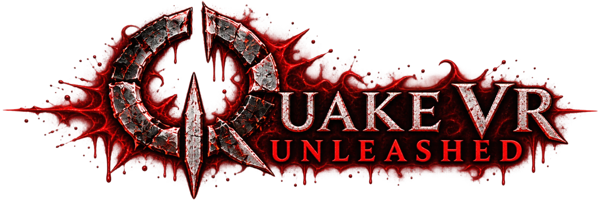

# Quake VR

**id Software's Quake (1996), rebuilt for virtual reality.**

Quake VR is a VR mod of Quake by Vittorio Romeo. You play the whole game, both mission packs included, with your
own hands and body: a weapon in each hand, aimed with one hand or two, holstered at your hips and shoulders, thrown
across the room or swung as a club. You walk around your room, crouch behind cover, punch, parry, headbutt, and swim
with your arms.

This version runs on the [Ironwail](https://github.com/andrei-drexler/ironwail) engine (0.8.2) and talks to your
headset through [OpenXR](https://www.khronos.org/openxr/). It is a new version of the
[original Quake VR](https://github.com/vittorioromeo/quakevr/tree/master), which ran on QuakeSpasm-Spiked and
SteamVR's OpenVR (see [Compared with the original Quake VR](#compared-with-the-original-quake-vr)).

> **Status:** in active development. It is playtested mostly on a Meta Quest 3 through Virtual Desktop. Other
> headsets and controllers work through OpenXR but have had less testing. Expect rough edges, and please report
> what you find.

**Contents:** [Features](#features) · [Compared with the original](#compared-with-the-original-quake-vr) ·
[Installation](#installation) · [First steps and basic tweaking](#first-steps-and-basic-tweaking) ·
[Documentation](#documentation) · [Building from source](#building-from-source) ·
[Credits and licence](#credits-and-licence)

## Features

The headlines, grouped. [docs/FEATURES.md](docs/FEATURES.md) explains each one, how to use it and where its settings
are.

### Weapons

- **A weapon in each hand:** every weapon of Quake and both mission packs, with modelled grips, iron sights, a glowing
  ammo screen, recoil, muzzle flashes and tracers, and a button on top for a second ammo type.
- **Two-handed aiming** by the foregrip, an optional virtual stock, and weight: heavy guns lag, want two hands, and
  can be wrenched from your grip. Hands and barrels stop at walls.
- **Holsters** at your hips, chest and shoulders; reload at a holster or flick the super shotgun open. **Hand
  grenades** from a pouch at your back.
- **New weapons to take:** knights' swords, the ogres' chainsaws (pull the cord), the grunts' burst rifles, the
  enforcers' laser rifles, crowbars from crates, and the grappling hook with a physical rope.

### Combat

- **Melee that reads real swings:** punches, blades, clubs and pistol-whips that land on the monster's real shape;
  axes that stick where you throw them.
- **Parry** with a weapon or crossed forearms (it stops the attack), **counter-attack**, **bash**, **shove**,
  **headbutt**, and **bat** spikes, lasers and grenades back. Catch grenades, or shoot them.
- **Bullet time**, from your wrist or a stick, with an optional Sandevistan mode.
- **Ragdolls and knockdowns:** corpses go limp as physical bodies you can drag and throw; a hard shove knocks a
  monster down to struggle back up, and off a ledge it always falls.
- **Stamina** and tired arms (optional), enemy shoves, and a **training dummy** that can be any enemy and fights
  back.
- **Positional damage** (headshots, arms and legs) and knockback in both directions.

### Physics and gore

- **Everything is physical:** thrown weapons, boxes, crates, rocks, explosive boxes you can stack and stand on, wall
  torches you take off the wall, gibs and heads, all rigid bodies with true-scale gravity. Throws are read from your
  hand as in Half-Life: Alyx and feel the same at any frame rate.
- **Force grab:** point, pull the trigger, flick your wrist, and catch.
- **Gore you can tune:** blood on walls, you, your weapons and props (water washes it off), sticking and dripping gibs,
  small gibs and brain chunks, wounds, beheading, head pops and limb gore.
- **Fire and lightning:** flames spread over monsters, corpses and crates and smoulder out; lightning leaves arcs,
  convulsions and burns, on you too.

### Movement and body

- Smooth or teleport locomotion, smooth or snap turning, comfort presets, and room-scale play with crouching,
  real jumps and leaning.
- **Swimming** with arm strokes, **climbing** ledges and rungs hand over hand, and the **grappling hook**.
- **Full body** with arms and legs (IK), three builds, your armour, wounds and powerups on it; hands fitted to what
  they hold. **VR Calibration** measures you at the first start.
- **Left- or right-handed**, every side-dependent option at once or one by one.

### Interface

- **Wrist gadget HUD:** health, armour, ammo and stamina on a CRT screen on your forearm, with the game's messages as
  a hologram. The classic status bar on a hand is still there.
- **Flashlight** on your belt: a shadow-casting torch you switch, take in hand, flip with a flick, or clip on a gun
  or your head.
- **VR menus** with a laser, live previews, drop-down lists, **search** (with your recent results), a **console**
  with a keyboard, Menu Detail levels and per-page reset; **tips** for new players, also placed by mappers.

### Graphics and sound

- **Relit maps**, made on your PC by a script or **in the game** (one map or every map, ericw-tools downloaded for
  you), with coloured light, ambient occlusion and lamps that light their rooms; **see-through water**.
- A **darker, moodier look** like DarkPlaces: coloured dynamic lights, real-time shadows, bloom, lit particles,
  models lit by the map's lights, bump maps (Quetoo's material maps shipped), parallax and detail textures.
- **Teleporters that show where they lead**, live: you, your missiles and the monsters' sight pass through.
- **Water** with waves, reflections, refraction, caustics, splashes and foam; tone mapping and colour grades; an
  optional **retro look**; FSR/NIS upscaling and foveated rendering.
- **Spatial sound** with Steam Audio (HRTF, occlusion, reverb), physics sounds, and the soundtrack played from the
  Quake you own.

### Maps, campaigns and play

- **Quake and both mission packs** in one game, from a VR hub with a tutorial and a firing range. The re-release's
  **Dimension of the Past**, **Dimension of the Machine** and **Dawn of the Machine** play natively (single
  player).
- **Map Library:** browse [Quaddicted](https://www.quaddicted.com/)'s custom maps and download, install, uninstall and
  play them in the game. **Other mods** run in a compatibility mode.
- **Multiplayer and bots** (FrikBot), with a fixed 72 Hz server tick; flat-screen play (`vr_enabled 0`).
- **For recording and testing:** a spectator camera, slow motion and highlight markers for trailers; voice notes, an
  in-game checklist, a motion recorder and debug pages for playtesters.

## Compared with the original Quake VR

The [original Quake VR](https://github.com/vittorioromeo/quakevr/tree/master) (the `master` branch, up to v0.0.7 beta)
was built on QuakeSpasm-Spiked and OpenVR. This version keeps its gameplay and QuakeC and rebuilds the rest.

| | Original (QSS + OpenVR) | This version (Ironwail + OpenXR) |
|---|---|---|
| Engine | QuakeSpasm-Spiked (2020), converted to C++ | Ironwail 0.8.2. The VR code is a separate module. |
| Headset API | OpenVR (SteamVR only) | OpenXR: SteamVR, Virtual Desktop (VDXR), Meta, and other runtimes |
| Controls | SteamVR Input bindings | Controller buttons are ordinary Quake keys: rebind them in Key Setup or the console |
| Installation | A separate folder: copy Quake's pak files into it (renamed, for the mission packs) | A `quakevr` folder in your Quake folder. The mission packs are found automatically. |
| Body | A floating torso | A full body with arms and legs (IK) |
| HUD | Status bar on a hand | Wrist gadget with a CRT screen, or the status bar |
| Lighting | Quake's lightmaps (optional external `.lit` files) | Relit maps, real-time shadows, per-pixel lights, bump maps, bloom, tone mapping |
| New in combat | | Parry, bash, headbutt, bullet time, ragdolls and knockdowns, enemy weapons, hand grenades, batting projectiles back, physics props, gore |
| New in movement | | Swimming with strokes, leaning, climbing, the grappling hook's rope, a flashlight on your belt |
| Other mods | Had to be ported | Run in a compatibility mode |
| Not (yet) carried over | | Index per-finger tracking (fingers follow the buttons instead) |

Saves and configs from the original version don't carry over.

## Installation

The short version is below. [docs/INSTALL.md](docs/INSTALL.md) has the details, the optional extras and
troubleshooting.

**You need:**

- A Windows 10 or 11 PC (x64) that can run PC VR. The graphics card needs OpenGL 4.3.
- A PC VR headset and an **OpenXR runtime**: SteamVR, Virtual Desktop (its VDXR runtime), Meta Quest Link, or
  another.
- **Quake** ([Steam](https://store.steampowered.com/app/2310/QUAKE/) or GOG). Quake VR uses the original game data:
  the `id1` folder with `PAK0.PAK` and `PAK1.PAK`. The Steam version has it next to the 2021 re-release.
- The [Microsoft Visual C++ Redistributable](https://learn.microsoft.com/en-us/cpp/windows/latest-supported-vc-redist)
  (x64), if it isn't installed already.

**Steps:**

1. **Download Quake VR from [vittorioromeo.com](https://vittorioromeo.com)**, where the download page will be
   listed: the package, `QuakeVR.zip`, is too large for a GitHub release. Or [build it yourself](docs/BUILDING.md).
2. Unzip it **into your Quake folder** (the folder containing `id1`), for example
   `C:\Program Files (x86)\Steam\steamapps\common\Quake`. This adds `ironwail.exe`, its DLLs, `QuakeVR.bat` and the
   `quakevr` game folder. If `hipnotic` and `rogue` are there too, the mission packs are used automatically.
3. Start your OpenXR runtime (SteamVR, or Virtual Desktop), and put the headset on.
4. Run **`QuakeVR.bat`**. It runs `ironwail.exe -game quakevr`, so a shortcut with those arguments works just as
   well.

**No expansion is required to play Quake in VR.** Hipnotic and Rogue are independent optional packs; their complete
owned data enables their campaigns and resources. Empty or corrupt pack folders are reported as unavailable.

You start in the **VR hub**. Pick Quake or an available mission pack there and step into the portal. The hub also
leads to the tutorial and the firing range.

The main menu's **Select Campaign** (the Official Campaigns page) shows detected owned campaigns and native gameplay readiness. Dimension
of the Past supports native single-player VR when its complete owned data and current language tables are available.
Dimension of the Machine (its story campaign and Horde mode) plays natively in single player the same way. Dawn of the
Machine is detected; its native VR gameplay port is still in progress. See the [campaign setup guide](docs/INSTALL.md#official-campaigns).

**Optional extras** (all in [docs/INSTALL.md](docs/INSTALL.md)):

- **HD textures:** the Quake Revitalization Project (QRP) map textures the author plays with, as one zip to extract
  into the Quake folder: the [HQ texture pack (PNG)](https://github.com/vittorioromeo/quakevr/releases/tag/textures-2026-10-03)
  release ([docs/vr-port/TEXTURES.md](docs/vr-port/TEXTURES.md): contents, credits, licence). Or from the
  [QRP Archive on ModDB](https://www.moddb.com/addons/quake-revitalization-project-archive): their `textures`
  folders go in `id1`, `hipnotic` and `rogue`.
- **Relit maps and see-through water:** made on your own PC from your copy of Quake. id Software's maps can't be
  redistributed, so they aren't in the package. The game relights maps itself (*Advanced VR > Graphics >
  Relighting*: this map, an episode, a game or every map, in the background); the script in
  `quakevr\tools`, with the VisPatch data, also makes water, slime and teleporters see-through.
  [docs/RELIGHTING.md](docs/RELIGHTING.md) has the steps. It takes about a minute.
- **Transcribing voice notes** with Whisper. This is for playtesters.

**Network and privacy.** The game sends nothing about you or your play. It goes online only for these:

- **Update check:** at start-up, at most once an hour, it reads the latest release's `latest.json` from GitHub. If a
  newer version is out, the menus say so in their bottom right
  corner. To turn it off: *Advanced VR > HUD and Menus > Menu > Check for Updates*
  (`vr_update_check 0`).
- **Map Library:** at start-up, at most once a day, it fetches Quaddicted's package index (`vr_maps_fetch 0` turns
  this off). It downloads maps only when you ask.
- **Relighting:** it downloads ericw-tools only when you ask.

## First steps and basic tweaking

**Default controls** (main hand / off hand):

| Button | Main hand | Off hand |
|---|---|---|
| Trigger | Fire | Fire the off-hand weapon (or use the force grab) |
| Grip | Grab, hold, and let go to drop or throw | Same |
| A / X | Jump | Reload |
| B / Y | Next weapon | Previous weapon. Held at your mouth, it records a voice note. |
| Stick | Turn. Up and down swim up and down. | Move |
| Stick click | Reload | Run / walk |
| Menu button | Menu (on Index controllers, and Quest controllers under SteamVR: the left B/Y button) | |

Every button can be rebound in **Options > Key Setup** or with `bind` in the console. They are named like gamepad
keys (`RTRIGGER`, `LSHOULDER`, `ABUTTON`...). See [docs/SETTINGS.md](docs/SETTINGS.md#controls-and-bindings).

**VR Settings** (the main menu's *VR Settings*, menu > Options > VR Settings, or `menu_vr` in the console) has the
settings most people need, each with a line of help. Point at it with the laser and pull the trigger, or use the sticks:
A selects, B goes back. The first time you start with the headset on, **VR Calibration** runs by itself: it measures
your height and body, and its room's buttons set the main options (the main menu's first row, or *Advanced VR > Run VR
Calibration Again*, runs it again). Worth checking first, top to bottom:

1. **Height and hands:** *Height* (stand straight and pick *Set Height Now*), *World Scale*, *Floor Offset*; then
   *Show Controller* and the *Hand* rows to line the drawn hands up with your real ones. If shots go above or below
   where the gun seems to point, change *Hand Pitch* first.
2. **Moving:** *Move Towards* (head or a hand), *Default Speed*, *Swap Stick Functions*, the comfort *Vignette*,
   *Teleport*, and *Turning Mode* (smooth, or snap 30/45/90 degrees) with its speed or angle.
3. **Weapons and body:** *Weapon Grip* set to *Sticky* keeps weapons in your hand without holding the grip;
   *Two-Handed*, *Body Type*, *Wrist Gadget Arm*, the *Flashlight* and its hip.
4. **Sound and display:** *Volume*, *Music Volume*, *HUD* (wrist gadget or status bar), *Crosshair*, *Headset Gamma*,
   *Render Scale* with its upscaling and foveated rendering, and the main graphics switches.

Everything else is in **Advanced VR** (the main menu's *Advanced VR* row, or the corner's *Advanced VR* button): the
*Comfort* preset, *Handedness*, *Body Calibration*, each hand's own calibration, the *Graphics Preset*, the *OpenXR
Runtime* and every gameplay page.

**Performance:** the shipped settings are tuned for a fast PC. If frames drop, pick a lower *Graphics Preset* (Advanced
VR > Graphics: Off, Low, Medium, High or Ultra) and lower *Render Scale* (VR Settings) below 1.

**Search:** the corner's *Search* button finds any setting by its name or what it
does, as you type, and opens its page on it (a cvar's name works too, e.g. `vr_snap_turn`).

**Tips:** new players get a tip the first time they come near something they can use (for now, a wall torch), shown
once: a small CRT screen like the maps' text boards floating beside it with a cable to it (turned towards you, or with
*Panel Facing: Square to your view* always flat in front of you), or, with *Advanced VR > Tips > Tips: Wrist gadget*, in the
gadget's hologram (it chimes and buzzes until you look at it). The Tips page sets how near you must be, whether it must be
in sight and in view, the delay and how long a tip shows; *Show Tips Again* resets them, *Show the Torch Tip Now* tries
one on the nearest torch.

**Console:** the corner's *Console* button shows Quake's console with a keyboard under it, to type commands in the
headset: *Run* runs the line, *Tab* completes it, *Prev* and *Next* go through the history (shared with the desktop
console); the stick, the wheel or Page Up and Down scroll the text.

**More:** every page ends with **Menu Detail**. *Standard* (the default) shows what every player sets; *Advanced* shows
every gameplay, display and graphics setting (Advanced VR Options, the main menu's *Advanced VR*: about sixty pages: combat, movement, carrying and
throwing, gore, the body, weapons, the HUD, graphics...); *Developer* adds the tuning pages (weapon and prop offsets and
weights, ragdolls, hitboxes), recording, debug and tests. A setting you changed has a `*` by it; *Changed Settings*
(Advanced VR) lists them all, and each page's *Reset This Page* puts its settings back. [docs/SETTINGS.md](docs/SETTINGS.md)
covers them.

**Starting over:** *Options > Reset All* restores the shipped settings and bindings. Your settings are saved in
`quakevr\ironwail.cfg`: delete it for a completely fresh start (VR Calibration then runs again).

## Documentation

For players:

- [docs/INSTALL.md](docs/INSTALL.md): installation in detail, OpenXR runtimes, HD textures, relit maps, mission
  packs and mods, performance, troubleshooting.
- [docs/RELIGHTING.md](docs/RELIGHTING.md): relighting your own copy of Quake's maps, for the relit look and
  see-through water, step by step.
- [docs/FEATURES.md](docs/FEATURES.md): every feature, and how to use it.
- [docs/SETTINGS.md](docs/SETTINGS.md): advanced settings, all the menu pages, console variables, config files.

[docs/README.md](docs/README.md) lists every document, with a line on each.

For developers:

- [docs/BUILDING.md](docs/BUILDING.md): building the engine, the QuakeC and the release package, and the tool
  scripts.
- [docs/vr-port/](docs/vr-port/): the port's design notes. [PLAYTEST.md](docs/vr-port/PLAYTEST.md) is the playtest
  guide, [TESTING.md](docs/vr-port/TESTING.md) the testing tools, [ROUND21.md](docs/vr-port/ROUND21.md) the log of
  the current feedback round (its older sections in `archive/`, the earlier rounds in git history), and there are
  deep dives into graphics, lighting, throwing, hitboxes and body IK.

## Building from source

Build `Windows\VisualStudio\ironwail.sln` (Visual Studio 2022 with clang-cl, Release | x64): the build compiles the
QuakeC too (`quakevr\progs.dat`), with FTEQCC from `-p:QvrQcCompiler=<path to fteqcc64.exe>`. Then
`Windows\package-quakevr.ps1 -Fteqcc <path to fteqcc64.exe>` puts the package in `dist\QuakeVR` and
`dist\QuakeVR.zip`. [docs/BUILDING.md](docs/BUILDING.md) has the details. VR needs Windows x64.
The other platforms build with a mock headset only, for development. A Windows installer (C#, WPF) is in development
in [Installer/](Installer/README.md). A release (both built in Release, checked, packaged, tagged and put on GitHub) is
one command, `Misc\release\make_release.ps1 -Version x.y.z [-Publish]`: [docs/vr-port/RELEASING.md](docs/vr-port/RELEASING.md).

## Credits and licence

Quake VR is by **Vittorio Romeo**. It builds on:

- **[Ironwail](https://github.com/andrei-drexler/ironwail)** by Andrei Drexler and contributors: a fast
  [QuakeSpasm](https://sourceforge.net/projects/quakespasm/) fork, which descends from FitzQuake and id Software's
  Quake. Ironwail's own features, such as playing the 2021 re-release content, the Mods menu and its HUD styles,
  are described in [its README](https://github.com/andrei-drexler/ironwail#readme).
- The **original Quake VR** and the ports it grew from: Fishbiter's and Zackin5's OpenVR ports, Dominic
  Szablewski's Oculus port, and Spike's QuakeSpasm-Spiked.
- Hand models by [CrazyHairGuy](https://www.crazyhairguy.com/). Weapon models are based on
  [Authentic Model Improvements](https://github.com/NightFright2k19/authmdl).
- The world's normal, specular and glow maps are from the [Quetoo](https://github.com/jdolan/quetoo) game data by
  Jay Dolan (jdolan) and contributors, made for Rygel's Texturepack Ultra (from the Quake Retexture Project and
  others; id Software's textures retextured), under
  [CC BY-SA 4.0](https://creativecommons.org/licenses/by-sa/4.0/): see
  [quakevr/textures_quetoo/README.md](quakevr/textures_quetoo/README.md) for every author.
- Box3D (Erin Catto) for the physics, Steam Audio (Valve) for the spatial sound, Zancle (Vittorio Romeo), FrikBot
  (Ryan "FrikaC" Smith), the OpenXR SDK (Khronos), SDL2, GLM, FTEQCC, and ericw-tools. The Map Library's maps come
  from [Quaddicted](https://www.quaddicted.com/).

The full list, with the research and techniques used, is in [docs/vr-port/CREDITS.md](docs/vr-port/CREDITS.md).

Quake VR is free software under the **GNU General Public License v2** ([LICENSE.txt](LICENSE.txt)), like the Quake
engine it comes from. Quake's game data (maps, models, sounds, textures) belongs to id Software and isn't included:
you need your own copy of Quake.
